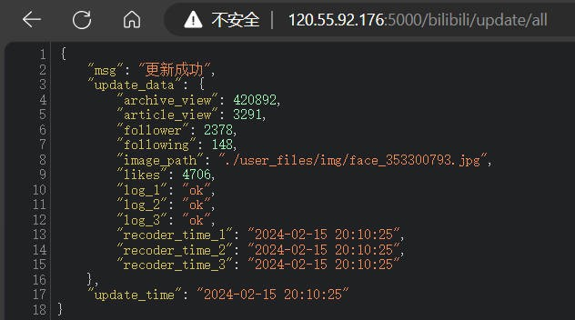
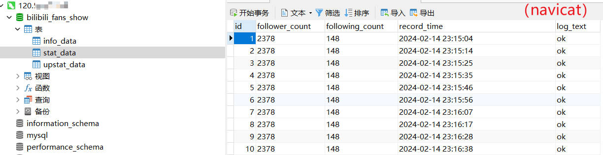

# 哔哩哔哩个人用户信息接口
该项目能够自动定时获取用户粉丝数、关注数、播放量、阅读量、用户图像等信息，并存储到mysql数据库中，并可通过接口进行数据请求，返回json数据。开发此项目是为了构建一个数据网页（数据大屏），显示个人bilibili粉丝数等用户数据。

注意：该项接口目前进可请求获取粉丝数、请求更新粉丝数、播放量等上述用户信息。更多功能待开发，或可阅读代码后自行拓展功能。


## 1 安装与使用
### 1.1 环境要求
#### (1) Windows运行通过的环境:
- Win11
- mysql==8.0.34
- Flask==3.0.0
- PyMySQL==1.1.0

#### (2) Linux运行通过的环境:
- centos-release-7-9.2009.1.el7.centos.x86_64
- mysql  Ver 14.14 Distrib 5.7.44, for Linux (x86_64) using  EditLine wrapper
- Flask==2.0.3
- PyMySQL==1.0.2

### 1.2 配置
#### (1) 修改：`conf.ini`中的`[database]`中的数据库信息
如果是本地数据库配置如下：
```
[database]
host = localhost
port = 3306
username = root
password = 123
database = bilibili_fans_show
```
云端数据库则修改host为公网ip
#### (2) 修改：`conf.yaml` 中的 cookie，如：
```
browser_request_data:
  headers: {
    'user-agent': "Mozilla/5.0 (Windows NT 10.0; Win64; x64) AppleWebKit/537.36 (KHTML, like Gecko) Chrome/100.0.4896.75 Safari/537.36",
    'cookie': ""
  }
```
如果不用cookie，则可能部分数据抓取不到，可自行尝试。
#### (3) 其他修改：
- 可修改config.ini中的更新频率

### 1.3 运行
#### (1) Windows
运行：`bilibili_api.py` 启动接口服务
运行：`update_bilibili_info.py` 以配置文件中的频率自动更新数据库中的数据

#### (2) Linux
终端运行：`sh install.sh`

### 1.4 测试
在浏览器输入：
`http://<ip>:5000/bilibili/fans`

`http://<ip>:5000/bilibili/update/all`

若能返回json数据则表示安装成功，下图是示例




同时，打开数据库可看到不断新增的数据

## 2 使用（接口文档）
获取粉丝数 
`http://<ip>:5000/bilibili/fans`

更新所有数据 
`http://<ip>:5000/bilibili/update/all`

更新粉丝数、关注是 
`http://<ip>:5000/bilibili/update/stat`

更新播放量、阅读量、点赞量 
`http://<ip>:5000/bilibili/update/upstat`

更新用户图像 
`http://<ip>:5000/bilibili/update/info`


## 3 技术解析
### 3.1 技术流
1. 爬取数据源：粉丝数、播放量、用户图像（api或源码解析）
2. 数据库：mysql（将爬取到的数据储存到数据库中，Python+pymysql）
3. 创建后端api：Python+Flask
4. 部署：将数据库部署到云服务器；后端代码作为服务部署到云服务器

### 3.2 爬取数据源并写入数据库
#### （1）解析
分析bilibili网站后台请求数据可获取到3条相关api接口，接口与2023年相比播放量那个api有改变。3条接口如下：
```
https://api.bilibili.com/x/relation/stat?vmid=353300793 
https://api.bilibili.com/x/space/wbi/acc/info?mid=353300793&token=&platform=web&web_location=1550101&w_rid=8b85e4911af11fa277aca4952002e4f5&wts=1707719647 
https://api.bilibili.com/x/space/upstat?mid=353300793&jsonp=jsonp
```
解析过程关键步骤如下图：
（暂无）

#### （2）代码（爬取数据并写入数据库）
详见 `GenUserInfo.py`

#### （3）代码（数据库操作）
详见 `read_date_base.py`

### 3.3 创建后端api
使用flask框架
#### 代码（创建api）
详见 `bilibili_api.py`

#### 代码（更新数据）
详见 `update_bilibili_info.py`

## 4 部署环境
### 4.1 服务器环境准备
#### （1）阿里云ECS-CentOs安装mysql
下面的`12345678`未数据库密码
**常规安装步骤：**

1. 更新YUM源。
`rpm -Uvh http://dev.mysql.com/get/mysql57-community-release-el7-9.noarch.rpm`

2. 安装MySQL。
`yum -y install mysql-community-server --nogpgcheck`

3. 查看MySQL版本号。
`mysql -V`

4. 启动MySQL服务。
`systemctl start mysqld`

5. 设置MySQL服务开机自启动。
`systemctl enable mysqld`

6. 配置MySQL的root用户密码。
   1. 执行`grep 'temporary password' /var/log/mysqld.log`，查看/var/log/mysqld.log文件，获取root用户的初始密码。
   2. 执行`mysql -uroot -p`输入log中密码
   3. 执行`set global validate_password_policy=0;`，修改MySQL的root用户的初始密码。PS:修改密码安全策略为低（只校验密码长度，至少8位）。
   4. 执行`ALTER USER 'root'@'localhost' IDENTIFIED BY '12345678';`设置新密码为12345678
   5. 执行`GRANT ALL PRIVILEGES ON *.* TO 'root'@'%' IDENTIFIED BY '12345678' WITH GRANT OPTION;`，授予root用户远程管理权限。

7. 使用root用户登录数据库。
`mysql -uroot -p12345678`

**使用安装脚本**
备注：下面此2个脚本为上面7个步骤转写，有些步骤不能写在脚本中，需要手动操作后续步骤。
```
#1. 更新YUM源。
rpm -Uvh http://dev.mysql.com/get/mysql57-community-release-el7-9.noarch.rpm
#2. 安装MySQL。
yum -y install mysql-community-server --nogpgcheck
#3. 查看MySQL版本号。
mysql -V
#4. 启动MySQL服务。
systemctl start mysqld
#5. 设置MySQL服务开机自启动。
systemctl enable mysqld
```
```
# 更新YUM源
rpm -Uvh http://dev.mysql.com/get/mysql57-community-release-el7-9.noarch.rpm
# 安装MySQL
yum -y install mysql-community-server --nogpgcheck
# 查看MySQL版本号
mysql -V
# 启动MySQL服务
systemctl start mysqld
# 设置MySQL服务开机自启动
systemctl enable mysqld
# 配置MySQL的root用户密码
# a. 获取root用户的初始密码
temp_password=$(grep 'temporary password' /var/log/mysqld.log | awk '{print $NF}')
# b. 输入初始密码登录
mysql -uroot -p$temp_password
```
使用root用户登录数据库<br />mysql -uroot -p12345678
#### （2）Mysql配置
授权用户远程访问：<br />格式：GRANT {权限} ON {库表} TO '{用户名}'@'{访问地址}' IDENTIFIED BY '{密码}'
```
#mysql中执行授权命令
GRANT ALL PRIVILEGES ON *.* TO 'root'@'%' IDENTIFIED BY '12345678@';
#手动刷新权限
flush privileges;
```
### 4.2 阿里云ECS 安装Python，发现已有Python3.6
pass
